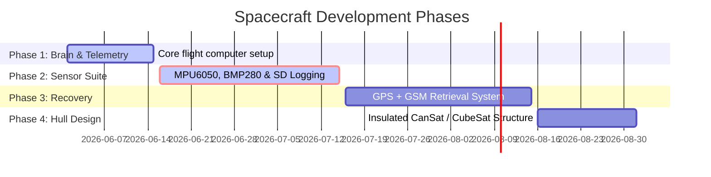
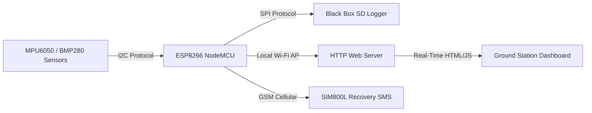

# 🛰️ DIY Mini Satellite & Rocket Payload System

[](https://github.com/)
[](https://opensource.org/licenses/MIT)

A localized, ESP8266-powered telemetry system, flight computer, and sensor payload container designed for CanSat, CubeSat, and High-Altitude Balloon (HAB) missions, with planned transitions to model rocket guidance.

> [!IMPORTANT]
> **Work in Progress (WIP):** This project is in active development. Phase 1 is functional, but sensor integration (Phase 2) and recovery modules (Phase 3) are still under construction. Code may change frequently.

---

## 📍 Project Status & Roadmap



* **Phase 1: Core Flight Computer (COMPLETED):** NodeMCU Access Point broadcasting a local Wi-Fi telemetry dashboard.
* **Phase 2: Sensor Suite (ACTIVE):** Integration of orientation (MPU6050 IMU), altitude/temp (BMP280), and SD card data logging.
* **Phase 3: Navigation & Retrieval (UPCOMING):** GPS tracking and SIM800L SMS coordinates broadcast on descent.
* **Phase 4: Structures (UPCOMING):** 1U CubeSat / CanSat frame configuration with sub-zero stratospheric insulation.
* **Phase 5: Near-Space Launch:** Stratospheric test flight on a helium High-Altitude Balloon.
* **Phase 6: Rocket Guidance:** Transitioning payload to a model rocket payload bay, integrated with a KK2.1 flight controller for active aerodynamic stabilization.

---

## 🛠️ System Architecture

### Telemetry & Signal Flow



### Hardware Pinout Configuration

| Module | Pin (NodeMCU) | Description | Protocol |
| :--- | :--- | :--- | :--- |
| **MPU6050 IMU** | `D2` (SDA), `D1` (SCL) | Orientation (Pitch, Roll, Yaw) | $I^2C$ |
| **BMP280 Altimeter**| `D2` (SDA), `D1` (SCL) | Barometric Pressure & Temp | $I^2C$ |
| **MicroSD Module** | `D5` (CLK), `D6` (MISO), `D7` (MOSI), `D8` (CS) | Telemetry Data Logger | SPI |
| **NEO-6M GPS** | `D3` (RX), `D4` (TX) | Position & Coordinates | SoftwareSerial |
| **SIM800L GSM** | Custom Serial | Terrestrial SMS recovery transmission | Serial |

---

## 🚀 Setup & Installation

### 1. Prerequisites
* [Arduino IDE](https://www.arduino.cc/en/software) or PlatformIO.
* ESP8266 Board Core installed in Arduino IDE.
* Library Dependencies:
  * `Adafruit_BMP280`
  * `Adafruit_MPU6050`
  * `SD` (Standard SPI Library)

### 2. File Preparation
Before uploading, copy `config.example.h` to `config.h` and configure your credentials:
```bash
cp firmware/flight_computer/config.example.h firmware/flight_computer/config.h
```
Edit `config.h`:
```cpp
#define WIFI_SSID "Satellite-Brain-01"
#define WIFI_PASS "12345678"
#define RECOVERY_PHONE_NUMBER "+YOUR_NUMBER_HERE"
```

### 3. Uploading Firmware
1. Connect your NodeMCU to your computer via USB.
2. Select your board (`NodeMCU 1.0 (ESP-12E Module)`) and port (`COM3` or corresponding port).
3. Click **Upload**.

### 4. Accessing Mission Control
1. Power the CanSat/CubeSat with a 3.7V LiPo battery.
2. Search for the Wi-Fi network `Satellite-Brain-01` on your device.
3. Open your browser and navigate to `http://192.168.4.1`.
4. Monitor telemetry in real time!

---

## 📄 License
This project is licensed under the MIT License - see the [LICENSE](LICENSE) file for details.
